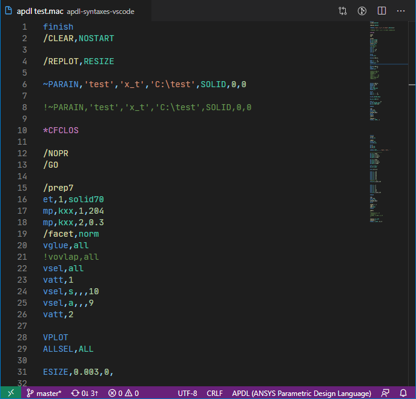

# APDL README

An extension with rich support for the APDL(ANSYS Parametric Design Languages) language.

See More: [github.com/rileychall/apdl-syntaxes-vscode](https://github.com/rileychall/apdl-syntaxes-vscode)

This is a fork of shenbo's [APDL extension](https://marketplace.visualstudio.com/items?itemName=shenbo.apdl).

## Features

Support file extensions:
- **.mac**
- **.ans**
- **.ansys.txt**
- **.ans.txt**
- **.ansys**
- **.apdl**

## Release Notes

**Version 0.1.3**: Reclassify keyword groups for separate syntax coloring. Classify comma as a unique operator.

**Version 0.1.2**: Fix Comments Symbol("!").

**Version 0.1.1**: Update .

**Version 0.1.0**: Initial release .

